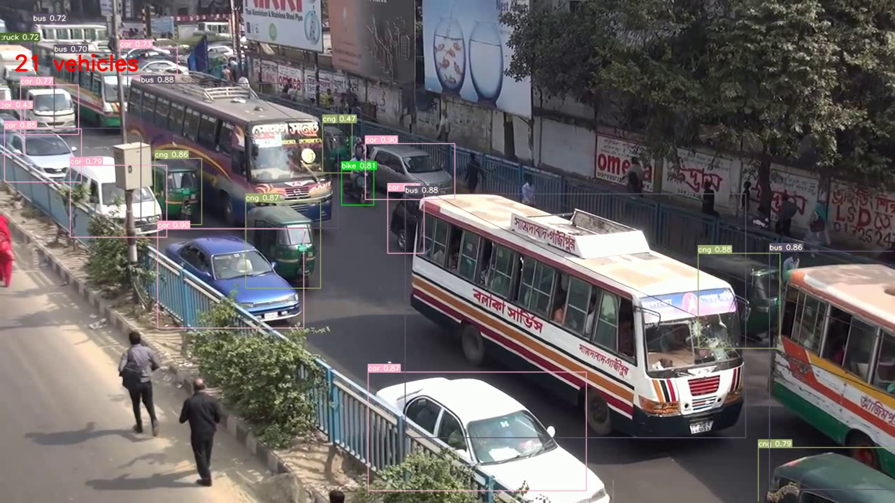
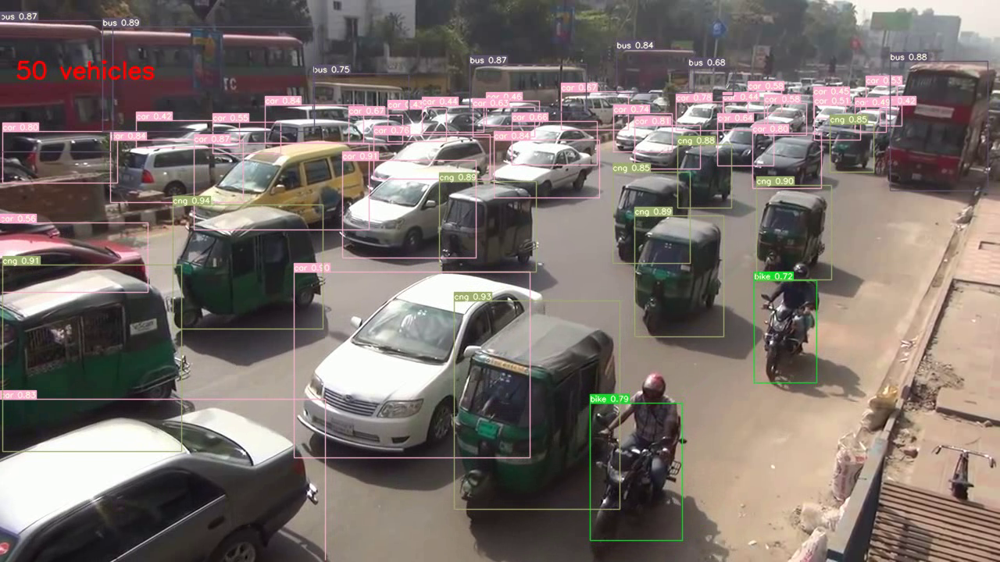
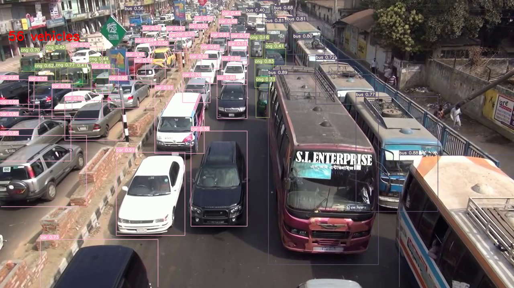

## Object count in yolov5

This file was taken from https://github.com/ultralytics/yolov5. Presented here is a modified version of the detect.py file that we use to detect objects from an image or video file.

On line 103 of the file, you'll find the text appearing in the detected images/videos. If you look at line 125, you can edit it to change text position, color, font, or size.

Note that, when you run the detection on a video, it is done frame by frame. This means that the number of detected objects will go up or down according to the number of objects per frame.

Hope this helps. Cheers!

